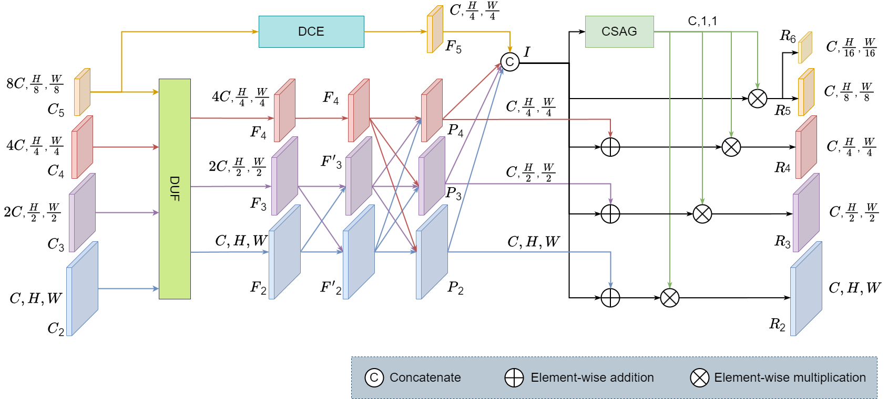

# Enhancing Object Detection with Channel-augmented Asymptotic Feature Fusion
This repository is the official implementation of "Enhancing Object Detection with Channel-augmented Asymptotic Feature Fusion". The work is currently being submitted to [The Visual Computer](https://link.springer.com/journal/371)



## Installation

If you want to run our code in the MMDetection library, please install the dependencies：
```
cd mmdetection-main
pip install -v -e .
```

If you want to run our code in YOLO, please install the dependencies:
```
cd YOLOv8
pip install -e .
```
## Training
### Prepare the dataset
We used the dataset in [MS COCO](https://cocodataset.org/#home) and [PASCAL VOC](http://host.robots.ox.ac.uk/pascal/VOC/index.html)

Organize the files in the dataset into the following format
```
├── iamges
│   ├── 1.png
│   └── 2.png
├── labels
      ├── 1.txt
      └── 2.txt
├──train.txt
├──val.txt
```
### Train

If you want to train in MMDetection, please run the following code：

Single gpu for train:
```
cd mmdetection-main
CUDA_VISIBLE_DEVICES=0 python ./configs/CAFPN/faster-rcnn_r50_cafpn_1x_coco.py --work-dir ./weight/
```
Multiple gpus for train:
```
CUDA_VISIBLE_DEVICES=0,1,2,3,4,5,6,7 ./configs/CAFPN/faster-rcnn_r50_cafpn_1x_coco.py 2 --work-dir ./weight/
```
If you want to train in YOLO, please run the following code：
```
cd YOLOv8
python train.py
```

## Evaluate
If you want to evaluate in MMDetection, please run the following code：
```
CUDA_VISIBLE_DEVICES=0 python ./tools/test.py ./configs/CAFPN/faster-rcnn_r50_cafpn_1x_coco.py ./weight/cafpn_weight.pth
```
If you want to evaluate in YOLO, please run the following code：
```
python val.py
```
## Results
Results on the MS COCO val2017
```markdown

| 标题1 | 标题2 | 标题3 |

|-------|-------|-------|

| 内容1 | 内容2 | 内容3 |

```

